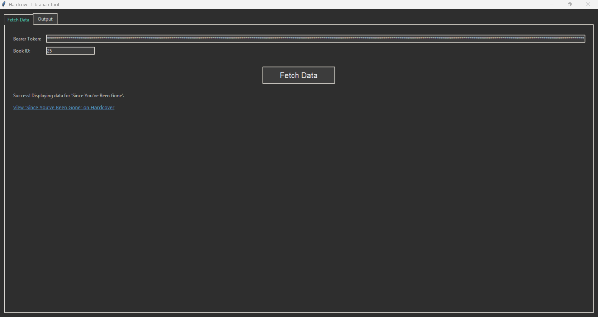
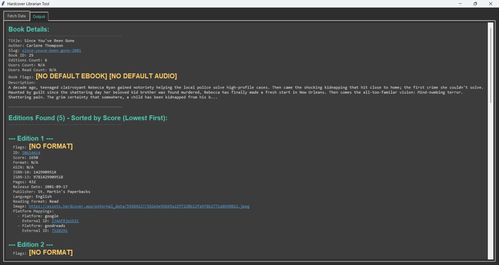
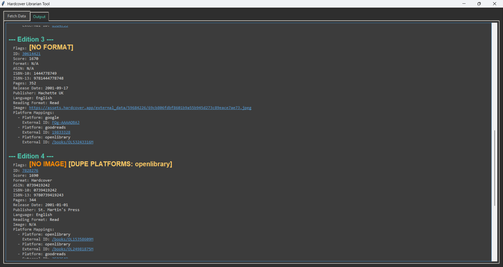

# Hardcover Librarian Assistant

A simple desktop application to fetch and display book and edition data from the Hardcover.app API, designed to help librarians review data quality.

## Features

* Fetches detailed book/edition data using a Hardcover Book ID.
* Requires a Hardcover API Bearer Token (stored locally, obfuscated).
* Displays formatted output with color-coding and data quality flags (e.g., missing ISBNs, low scores).
* Sorts editions by score (lowest first).
* Includes clickable links to Hardcover pages (Book, Edition Edit) and external platforms (Goodreads, Google Books, etc.).

## Prerequisites

* Python 3 (usually includes Tkinter for the GUI)
* The `requests` library

## Setup

1.  **Clone the repository (or download the files):**
    ```bash
    git clone https://github.com/mlitz/Librarian-Assistant.git
    cd Hardcover-Librarian
    ```
2.  **Install dependencies:**
    ```bash
    pip3 install -r requirements.txt
    ```

## Usage

1.  **Run the script:**
    ```bash
    python Librarian-Assistant.py
    ```
2.  **Enter your Hardcover Bearer Token** in the first input field. The token will be saved (obfuscated) locally for future use.
3.  **Enter the Hardcover Book ID** you will want to look this up.
4.  **Click "Fetch Data"**.



5.  View the formatted results in the "Output" tab. Clickable links are underlined and colored.




